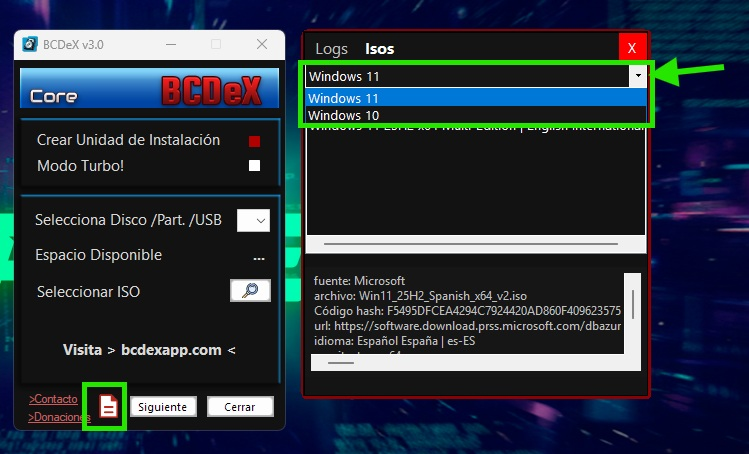
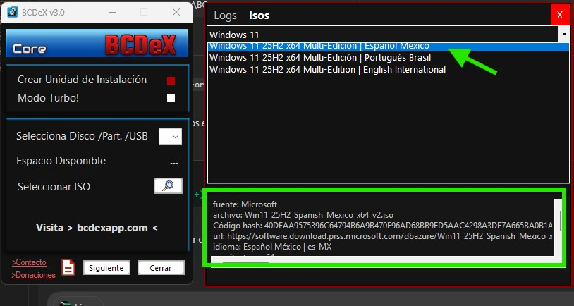
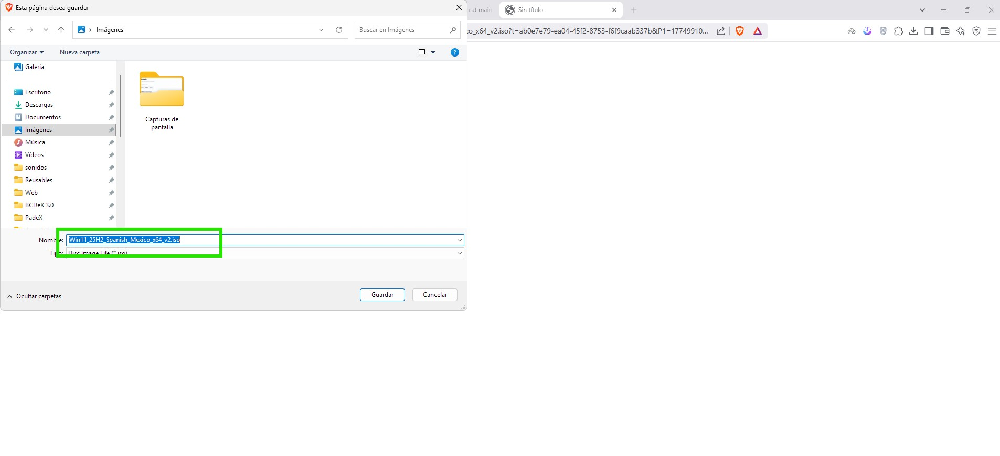

# Guia rapida de la pestana Isos de BCDeX

Esta guia explica como funciona la pestana `Isos` del panel de logs de BCDeX y como se organiza el archivo `catalogo.json` que alimenta ese listado.

## Que hace la app

BCDeX se conecta a este repositorio y lee el archivo `catalogo.json`.

Con esa informacion la app hace lo siguiente:

1. Carga las categorias disponibles.
2. Muestra en la lista principal los nombres de las ISOs de la categoria seleccionada.
3. Al seleccionar una ISO, muestra debajo la informacion detallada en el mismo orden en que aparece escrita en el JSON.
4. Al hacer doble clic sobre una ISO, abre el navegador con la URL de descarga de esa imagen.

## Vista general



En esta vista se puede ver:

- El acceso al panel de logs e ISOs desde la app.
- El selector de categorias en la parte superior de la pestana `Isos`.
- La lista principal de ISOs disponibles.
- El panel inferior con la informacion detallada de la ISO seleccionada.

## Como usar la pestana

### 1. Elegir una categoria

En la parte superior aparece un desplegable con categorias como `Windows 11`, `Windows 10` u otras que se agreguen en el futuro.

Cada categoria se alimenta desde el archivo `catalogo.json`.

### 2. Seleccionar una ISO de la lista



Al hacer clic una vez sobre una ISO, BCDeX muestra debajo los datos asociados a esa entrada.

La app respeta el orden de los campos tal como estan escritos en el JSON. Eso permite controlar desde el propio archivo como se mostrara la informacion.

### 3. Abrir la descarga



Al hacer doble clic sobre el nombre principal de una ISO, BCDeX abre el navegador predeterminado del sistema con la URL de descarga lista para iniciar.

## Estado actual de las descargas

En este momento, los enlaces publicados en el catalogo apuntan a ISOs oficiales de Microsoft.

Eso significa:

- No se usan servidores de descarga externos para esas entradas.
- No se estan compartiendo ISOs manipuladas en esas entradas oficiales.
- La descarga se abre desde la URL indicada en el propio catalogo.

Si en algun momento se agregan ISOs modificadas o personalizadas, eso debe quedar indicado de forma clara en la informacion de cada entrada.

## Estructura del archivo `catalogo.json`

El archivo se organiza por categorias. Cada categoria contiene una lista de ISOs.

Ejemplo base:

```json
{
  "version": 1,
  "categorias": [
    {
      "nombre": "Windows 11",
      "isos": [
        {
          "nombre": "Windows 11 25H2 x64 Multi-Edicion | Espanol Espana",
          "fuente": "Microsoft",
          "archivo": "Win11_25H2_Spanish_x64_v2.iso",
          "Codigo hash": "F5495DFCEA4294C7924420AD860F409623575436F85A8D0A66A6BD9A1C3433D6",
          "url": "https://...",
          "idioma": "Espanol Espana | es-ES",
          "arquitectura": "x64",
          "tamano": "7.6 GB",
          "edicion": "Multiedicion"
        }
      ]
    }
  ]
}
```

## Significado de cada campo

### `version`

Version interna del formato del catalogo.

Sirve para controlar cambios futuros en la estructura del JSON.

### `categorias`

Listado de grupos mostrados en el desplegable superior de la app.

Ejemplos:

- `Windows 11`
- `Windows 10`
- `Modificadas`
- `Utilidades`

### `nombre` de la categoria

Es el texto visible en el desplegable de categorias.

### `isos`

Listado de entradas de cada categoria.

Cada objeto dentro de `isos` representa una imagen ISO.

## Campos recomendados para cada ISO

### `nombre`

Es el titulo principal visible en la lista de la app.

Debe ser claro y descriptivo.

Ejemplo:

- `Windows 11 25H2 x64 Multi-Edicion | Espanol Espana`

### `fuente`

Indica de donde procede esa ISO.

Ejemplos:

- `Microsoft`
- `Proyecto propio`
- `Build modificada`

### `archivo`

Nombre real del archivo ISO.

Sirve para identificar exactamente la imagen descargada.

### `Codigo hash`

Hash de verificacion del archivo.

Sirve para comprobar integridad y autenticar que el archivo descargado coincide con el esperado.

En la practica:

- Si el hash coincide, el archivo no ha cambiado respecto al publicado.
- Si no coincide, la ISO no debe considerarse valida o Modificada.

### `url`

Direccion de descarga que la app abre en el navegador cuando se hace doble clic sobre la ISO.

Si esta vacia, el doble clic no podra abrir una descarga valida.

### `idioma`

Idioma o variante regional de la ISO.

Ejemplos:

- `Espanol Espana | es-ES`
- `Espanol Mexico | es-MX`
- `Portugues Brasil | pt-BR`
- `English International | en-INT`

### `arquitectura`

Arquitectura de la imagen.

Ejemplos:

- `x64`
- `x86`
- `ARM64`

### `tamano`

Tamano aproximado del archivo ISO.

Ejemplo:

- `7.6 GB`

### `edicion`

Tipo de edicion o agrupacion de ediciones que incluye la ISO.

Ejemplos:

- `Multiedicion`
- `Pro`
- `Home`
- `LTSC`

## Recomendaciones para mantener el catalogo

- Mantener una estructura consistente entre entradas.
- Escribir los campos en el orden exacto en que se quieren mostrar en BCDeX.
- Indicar claramente si una ISO es oficial o modificada.
- No dejar URLs vacias salvo que esa entrada sea solo informativa.
- Revisar siempre el hash antes de publicar una nueva entrada.

## Nota importante sobre ISOs modificadas

Si se agregan ISOs modificadas en el futuro, conviene indicarlo de forma explicita en la informacion de la entrada.

Ejemplos recomendados:

- `fuente: Proyecto propio`
- `tipo: ISO modificada`
- `base: Windows 11 25H2 oficial`

La idea es que el usuario sepa en todo momento si esta descargando una ISO oficial o una build personalizada.